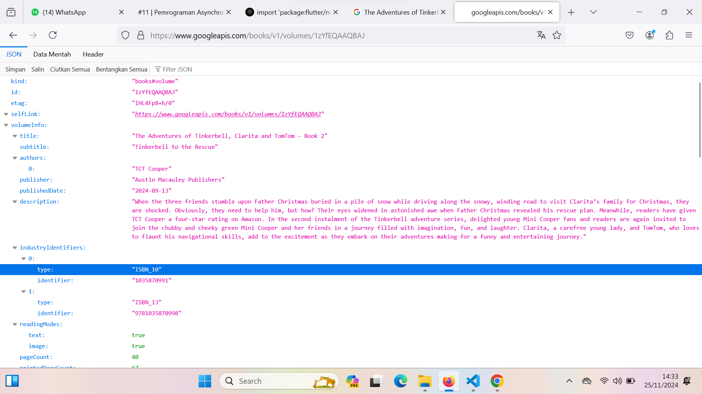
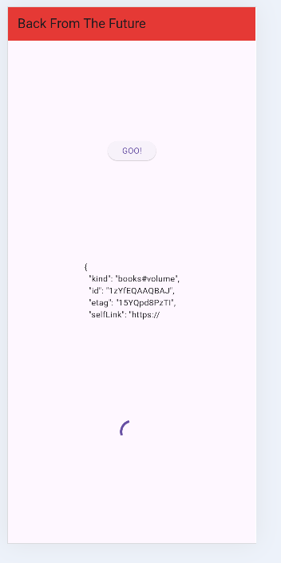
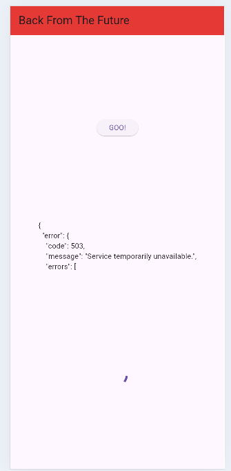
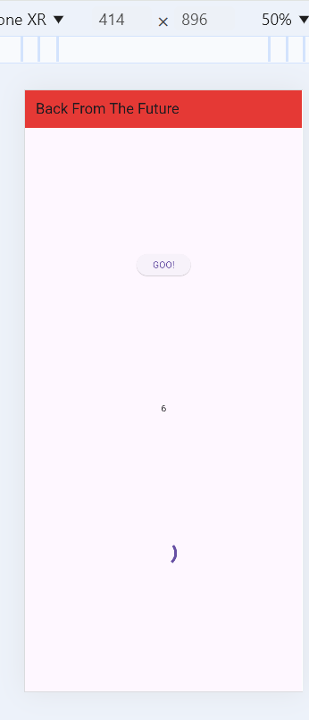
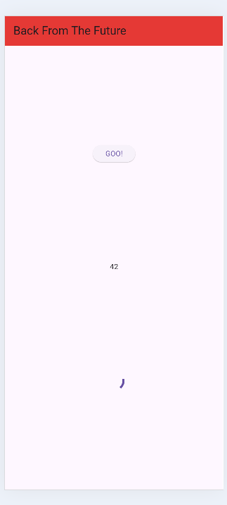
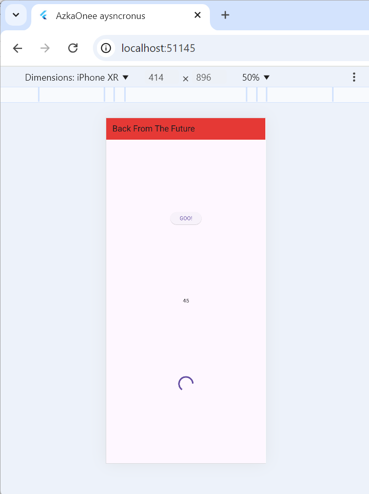
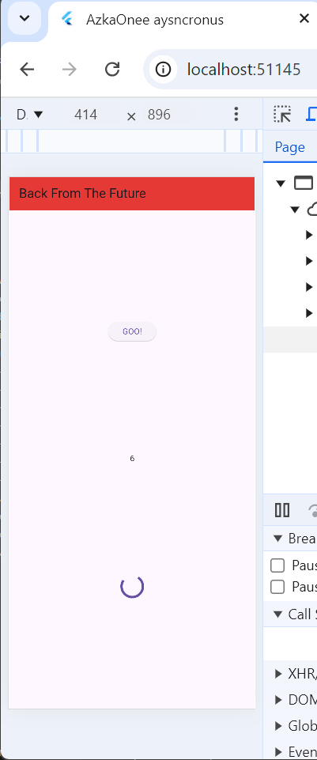
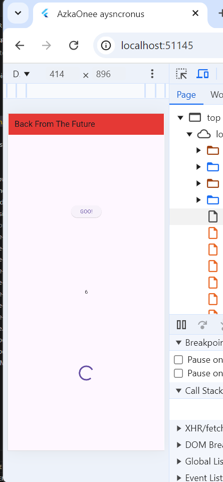
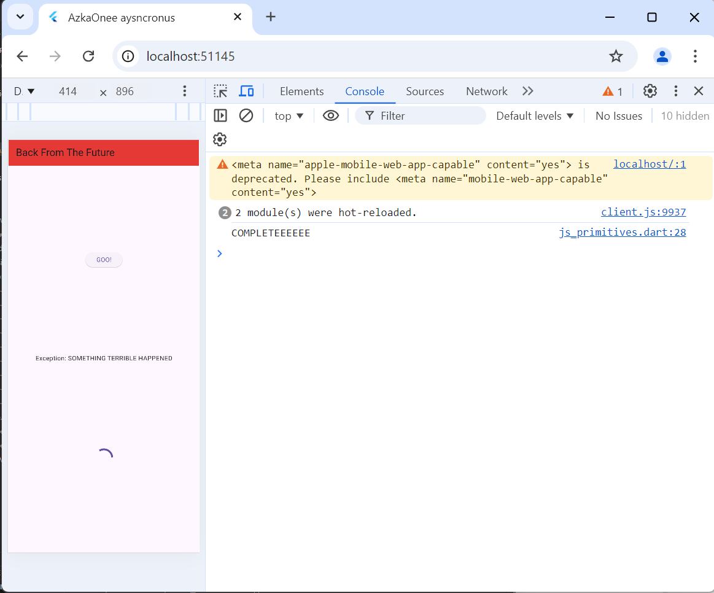
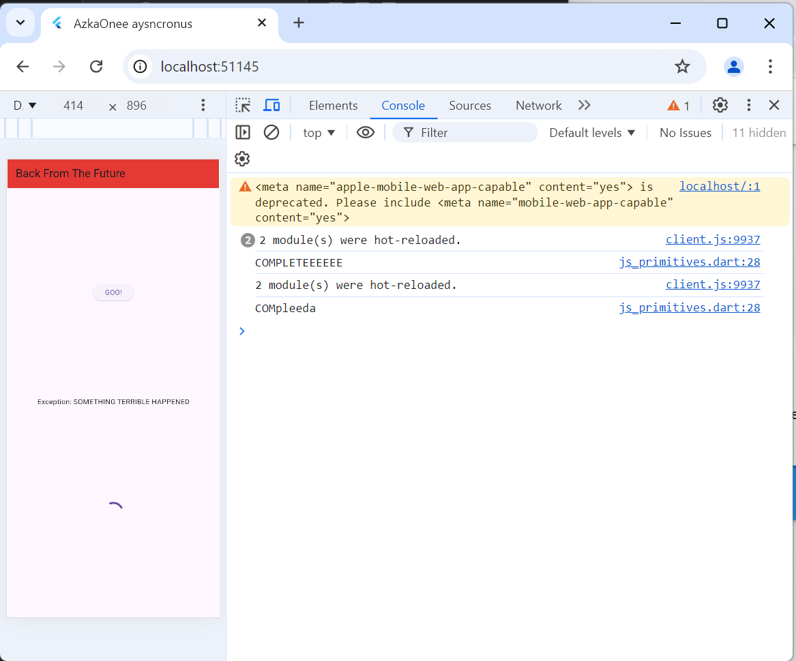

2.

3.
\

jadi substring digunakan untuk mengambil data dan akan membatasi hasil nya dimulai dari index 0-449.dan contoh gmbar ke dua adalah index dri 0-99.
untuk catch error adalah untuk menampilkan pesan error apabila terjadi error pada saat get data dedngan pesan  yang ada pada result dan akan mengubah tampilan ui dengan  perintah setstate.

4.
pada kode yang pertama adalah fungsi untuk mengembalikan nilai dari 1,2,3 jika sudah 3 detik
lalu pas kode ke 2 melakukan penghitungan nilai sesuai dengan nilai yang dikembalikan sebelumnya.lalu akan dipanggil pada elevated button dan harus menunggu 9 detik maka akan munculnilai 6 1+2+3=6.

5.

6.
pada kode ke 5 dilakukan penambhan cath dimana ketika proses await jika gagal akan memberikan pesan error yang akan ditampilkan pada kode ke 6 yaitu catcherror.

7.
8.
pada kode pertama mengunakan FutureGroup dimana merupakan library dari async yang akan mengelola future dan harus mengunakan close() untuk menghentikan future yang ditambahkan
sedangkan pad akode kedua adalah metode bawaan dart dan future yang dikembalikan harus sudah didefinisikan,dan tanpa memanggil close().

9.
10.
pada kode pertama cukup panjang untuk eksekusi kode pada button namun berbeda dengan kode kedua yang cukup pendek dimana pada handleerror memanggil returnerror.
