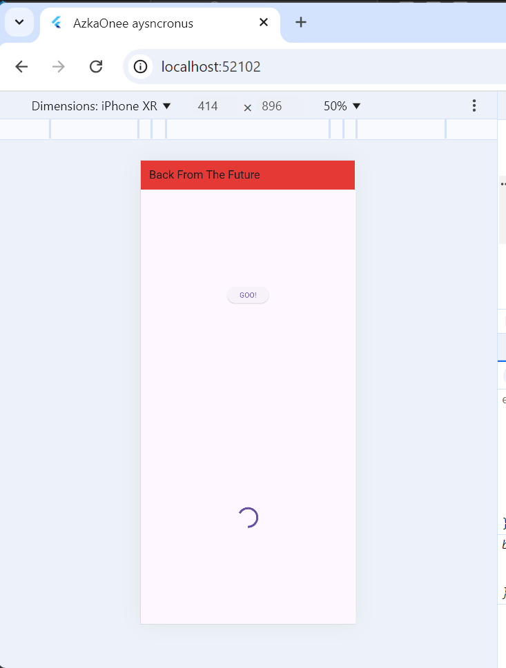
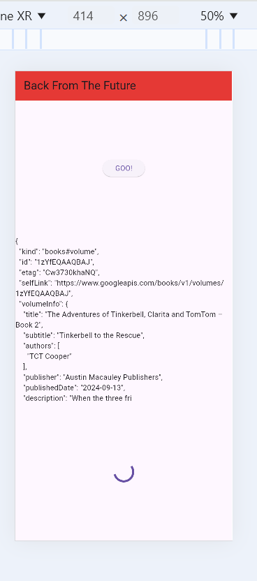

2.

3.

jadi substring digunakan untuk mengambil data dan akan membatasi hasil nya dimulai dari index 0-449.dan contoh gmbar ke dua adalah index dri 0-99.
untuk catch error adalah untuk menampilkan pesan error apabila terjadi error pada saat get data dedngan pesan  yang ada pada result dan akan mengubah tampilan ui dengan  perintah setstate
